# Transformers Cards for Home Assistant

A series of custom cards for Home Assistant inspired by the Transformers franchise and the iconic Teletraan-I computer system. These cards feature an angular, tech-inspired design with red/blue color schemes, tech panel effects, and the authentic Transformers Movie font.

These cards bring the futuristic aesthetic of Transformers and Cybertronian technology to your Home Assistant dashboard.

## Screenshots

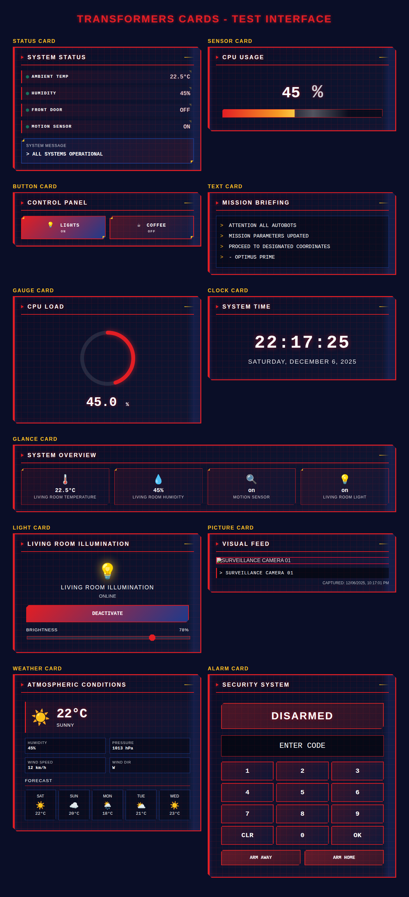

*All 11 card types in action, showcasing the Autobot-inspired design*

## Inspiration

The design draws inspiration from:
- The Teletraan-I computer from the original Transformers animated series
- The Transformers movie franchise visual effects and UI design
- Cybertronian technology aesthetics
- Angular, geometric design patterns characteristic of Transformers

## Features

- **Authentic Transformers Aesthetic**: Angular design with red/blue Autobot color schemes and tech panel styling
- **Multiple Card Types**: 11 different card types covering all major use cases
- **Transformers Font**: Official Transformers Movie font included for authentic typography
- **Customizable Themes**: Autobot (red/blue) and Decepticon (purple) color variants
- **Advanced Interactions**: tap_action support for navigation, services, and more
- **Dynamic Content**: State-based text display with template variables
- **Auto-Refresh**: Camera feed auto-update capability
- **Lightweight**: Built with Lit for optimal performance

## Installation

### HACS (Recommended)

1. Open HACS in your Home Assistant instance
2. Go to "Frontend" section
3. Click the menu icon in the top right
4. Select "Custom repositories"
5. Add this repository URL: `https://github.com/loryanstrant/ha-transformers-card`
6. Select category: "Lovelace"
7. Click "Add"
8. Find "Transformers Cards" in the list and click "Install"
9. Restart Home Assistant

### Manual Installation

1. Download the `transformers-cards.js` file from the latest release
2. Copy it to your `config/www` directory
3. Add the following to your `configuration.yaml`:

```yaml
lovelace:
  resources:
    - url: /local/transformers-cards.js
      type: module
```

4. Restart Home Assistant

## Development

For local development and testing:

1. Clone the repository
2. Install dependencies: `npm install`
3. Build the project: `npm run build`
4. Watch for changes: `npm run dev`

## Card Types

### 1. Status Card

Displays multiple entity states in a structured list format with status indicators.

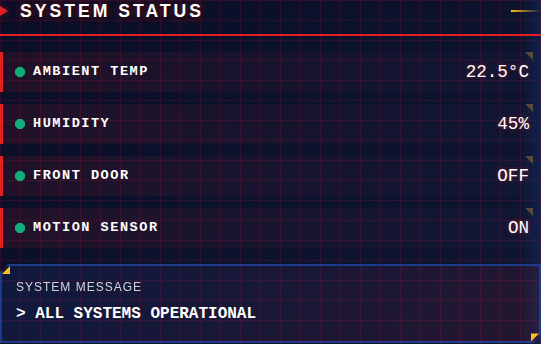

#### Configuration

```yaml
type: custom:transformers-status-card
title: SYSTEM STATUS
entities:
  - entity: binary_sensor.front_door
    name: MAIN ENTRANCE
  - entity: sensor.temperature_living_room
    name: AMBIENT TEMP
  - entity: sensor.humidity_living_room
    name: HUMIDITY LEVEL
  - entity: binary_sensor.motion_hallway
    name: MOTION DETECT
message: ALL SYSTEMS OPERATIONAL
show_message: true
theme: autobot
```

#### Options

| Name | Type | Default | Description |
|------|------|---------|-------------|
| `title` | string | `SYSTEM STATUS` | Card header text |
| `entities` | list | **required** | List of entities to display |
| `message` | string | `ALL SYSTEMS OPERATIONAL` | System status message |
| `show_message` | boolean | `true` | Show/hide the status message |
| `theme` | string | `autobot` | Color theme: `autobot`, `decepticon`, `red`, `yellow` |

### 2. Sensor Card

Displays a single sensor value with optional progress bar visualization.

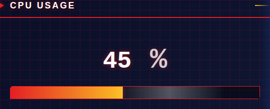

#### Configuration

```yaml
type: custom:transformers-sensor-card
entity: sensor.cpu_temperature
name: CORE TEMPERATURE
unit: "°C"
show_graph: true
max: 100
```

#### Options

| Name | Type | Default | Description |
|------|------|---------|-------------|
| `entity` | string | **required** | Entity ID to display |
| `name` | string | entity name | Custom display name |
| `unit` | string | entity unit | Custom unit of measurement |
| `show_graph` | boolean | `true` | Show/hide progress bar |
| `max` | number | `100` | Maximum value for progress bar |

### 3. Button Card

Interactive buttons for controlling entities or triggering services.

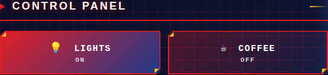

#### Configuration

```yaml
type: custom:transformers-button-card
title: CONTROL PANEL
columns: 2
buttons:
  - entity: light.living_room
    name: ILLUMINATION
    icon: 💡
    action: toggle
    show_state: true
  - entity: switch.coffee_maker
    name: BEVERAGE SYS
    action: toggle
  - service: script.security_protocol
    name: SECURITY
    icon: 🔒
```

#### Options

| Name | Type | Default | Description |
|------|------|---------|-------------|
| `title` | string | `CONTROL PANEL` | Card header text |
| `columns` | number | `1` | Number of columns (1-3) |
| `buttons` | list | **required** | List of button configurations |

Button configuration:
- `entity`: Entity to control
- `name`: Button label
- `icon`: Optional icon/emoji
- `action`: Action to perform (toggle, turn_on, turn_off)
- `show_state`: Display entity state
- `service`: Alternative service call (instead of entity)
- `service_data`: Data for service call
- `tap_action`: Advanced action configuration

### 4. Text Card

Displays text messages in Transformers terminal format with support for dynamic content.

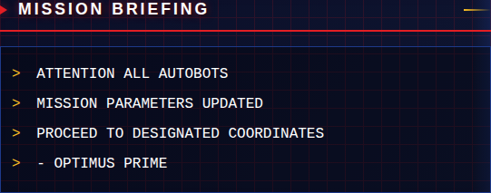

#### Configuration

```yaml
type: custom:transformers-text-card
title: SYSTEM NOTICE
content: |
  ATTENTION: ALL AUTOBOTS
  
  MISSION BRIEFING AT 0800 HOURS
  REPORT TO COMMAND CENTER
  
  - OPTIMUS PRIME
size: medium
align: left
show_prompt: true
```

#### Options

| Name | Type | Default | Description |
|------|------|---------|-------------|
| `title` | string | `MESSAGE` | Card header text |
| `content` | string | **required** | Text content to display |
| `entity` | string | optional | Entity to monitor for dynamic content |
| `state_content` | object | optional | State-specific content mapping |
| `size` | string | `medium` | Text size (small, medium, large) |
| `align` | string | `left` | Text alignment (left, center, right) |
| `show_prompt` | boolean | `true` | Show terminal prompt (>) |
| `typing_effect` | boolean | `false` | Animated typing effect |

**Dynamic Content Example:**

```yaml
type: custom:transformers-text-card
title: SECURITY STATUS
entity: alarm_control_panel.home
state_content:
  disarmed: |
    SYSTEM DISARMED
    ALL ZONES INACTIVE
  armed_away: |
    ALERT: SYSTEM ARMED
    PERIMETER SECURED
  triggered: |
    ⚠ ALARM TRIGGERED ⚠
    SECURITY BREACH DETECTED
  default: SYSTEM STATUS UNKNOWN
```

**Template Variables:**
- `{{state}}` - Entity state value
- `{{friendly_name}}` - Entity friendly name
- `{{unit}}` - Unit of measurement
- `{{attribute.name}}` - Any entity attribute

### 5. Gauge Card

Displays a circular gauge visualization for numeric sensors with customizable thresholds.

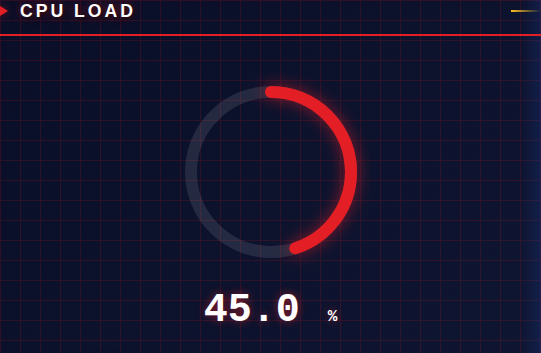

#### Configuration

```yaml
type: custom:transformers-gauge-card
entity: sensor.cpu_usage
name: CPU LOAD
min: 0
max: 100
decimals: 1
severity:
  yellow: 70
  red: 90
```

#### Options

| Name | Type | Default | Description |
|------|------|---------|-------------|
| `entity` | string | **required** | Entity ID to display |
| `name` | string | entity name | Custom display name |
| `unit` | string | entity unit | Custom unit of measurement |
| `min` | number | `0` | Minimum gauge value |
| `max` | number | `100` | Maximum gauge value |
| `decimals` | number | `1` | Number of decimal places |
| `severity` | object | `{}` | Severity thresholds (yellow, red) |

### 6. Clock Card

Displays current time and date in Transformers format with live updates.

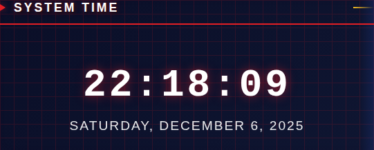

#### Configuration

```yaml
type: custom:transformers-clock-card
title: SYSTEM TIME
format_24h: true
show_seconds: true
show_date: true
show_timezone: false
```

#### Options

| Name | Type | Default | Description |
|------|------|---------|-------------|
| `title` | string | `SYSTEM TIME` | Card header text |
| `format_24h` | boolean | `true` | Use 24-hour time format |
| `show_seconds` | boolean | `true` | Display seconds |
| `show_date` | boolean | `true` | Display date |
| `show_timezone` | boolean | `false` | Display timezone |

### 7. Glance Card

Compact multi-entity overview card displaying multiple entities in a grid.

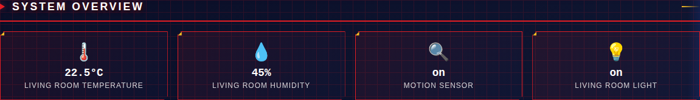

#### Configuration

```yaml
type: custom:transformers-glance-card
title: SYSTEM OVERVIEW
entities:
  - entity: sensor.temperature
    name: TEMP
  - entity: sensor.humidity
    name: HUMIDITY
  - binary_sensor.motion
  - light.living_room
columns: 2
show_name: true
```

#### Options

| Name | Type | Default | Description |
|------|------|---------|-------------|
| `title` | string | `SYSTEM GLANCE` | Card header text |
| `entities` | list | **required** | List of entities to display |
| `columns` | number | auto | Number of columns (2-5) |
| `show_name` | boolean | `true` | Show entity names |

### 8. Light Card

Dedicated light entity control with brightness slider and on/off toggle.

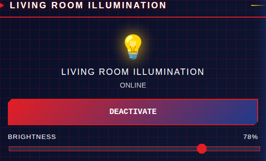

#### Configuration

```yaml
type: custom:transformers-light-card
entity: light.living_room
name: MAIN ILLUMINATION
```

#### Options

| Name | Type | Default | Description |
|------|------|---------|-------------|
| `entity` | string | **required** | Light entity ID |
| `name` | string | entity name | Custom display name |

### 9. Picture Card

Display images or camera feeds with Transformers-style filtering effects.

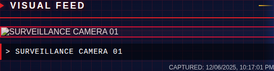

#### Configuration

```yaml
type: custom:transformers-picture-card
title: VISUAL FEED
entity: camera.front_door
# OR use a static image
# image: /local/my-image.jpg
caption: SURVEILLANCE CAMERA 01
show_timestamp: true
camera_refresh_interval: 5
```

#### Options

| Name | Type | Default | Description |
|------|------|---------|-------------|
| `title` | string | `VISUAL FEED` | Card header text |
| `entity` | string | optional | Camera entity ID |
| `image` | string | optional | Static image URL |
| `caption` | string | optional | Image caption |
| `show_timestamp` | boolean | `false` | Show capture timestamp |
| `camera_refresh_interval` | number | `0` | Auto-refresh interval in seconds (0 = disabled) |

### 10. Weather Card

Display weather information with current conditions and forecast.

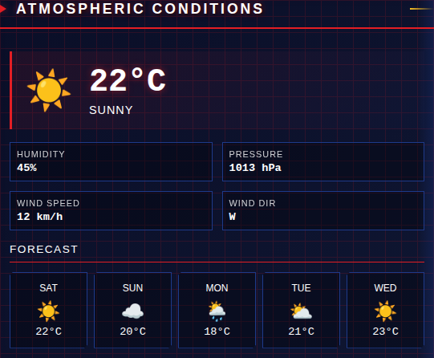

#### Configuration

```yaml
type: custom:transformers-weather-card
entity: weather.home
name: ATMOSPHERIC CONDITIONS
show_forecast: true
forecast_days: 5
```

#### Options

| Name | Type | Default | Description |
|------|------|---------|-------------|
| `entity` | string | **required** | Weather entity ID |
| `name` | string | entity name | Custom display name |
| `show_forecast` | boolean | `true` | Show weather forecast |
| `forecast_days` | number | `5` | Number of forecast days |

### 11. Alarm Card

Control alarm systems with a Transformers-style keypad interface.

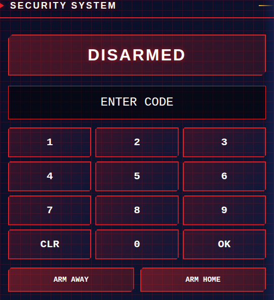

#### Configuration

```yaml
type: custom:transformers-alarm-card
title: SECURITY SYSTEM
entity: alarm_control_panel.home
show_keypad: true
```

#### Options

| Name | Type | Default | Description |
|------|------|---------|-------------|
| `title` | string | `SECURITY SYSTEM` | Card header text |
| `entity` | string | **required** | alarm_control_panel entity ID |
| `show_keypad` | boolean | `true` | Show numeric keypad |

## Styling

All cards use CSS custom properties for easy theming:

```css
--transformers-primary-color: #e31e24;        /* Autobot red */
--transformers-secondary-color: #1e3a8a;      /* Autobot blue */
--transformers-accent-color: #fbbf24;         /* Yellow accent */
--transformers-background-color: #0a0e27;     /* Dark background */
--transformers-panel-color: #1a1f3a;          /* Panel color */
--transformers-border-color: #e31e24;         /* Border color */
--transformers-text-color: #ffffff;           /* Text color */
--transformers-glow-color: rgba(227, 30, 36, 0.6);  /* Glow effect */
--transformers-font-family: 'Courier New', 'Monaco', monospace;
--transformers-header-font: 'Transformers Movie', 'Arial Black', sans-serif;
--transformers-grid-opacity: 0.15;            /* Grid pattern opacity */
```

### Transformers Movie Font

The project includes the **Transformers Movie** font for authentic typography. The font is automatically loaded and can be enabled by setting the appropriate CSS custom property:

```css
--transformers-header-font: 'Transformers Movie', 'Arial Black', sans-serif;
```

**Font License**: Freeware, Non-Commercial Use  
**Source**: https://www.fontspace.com/transformers-movie-font-f34560

## Examples

### Security Dashboard

```yaml
type: vertical-stack
cards:
  - type: custom:transformers-text-card
    title: SECURITY SYSTEM
    content: AUTOBOT SECURITY PROTOCOL ACTIVE
    size: large
    align: center
    
  - type: custom:transformers-status-card
    title: PERIMETER STATUS
    entities:
      - binary_sensor.front_door
      - binary_sensor.back_door
      - binary_sensor.garage_door
      - binary_sensor.motion_entrance
    message: PERIMETER SECURE
    
  - type: custom:transformers-alarm-card
    title: SECURITY CONTROL
    entity: alarm_control_panel.home
```

### Climate Control

```yaml
type: horizontal-stack
cards:
  - type: custom:transformers-sensor-card
    entity: sensor.temperature_living_room
    name: AMBIENT TEMP
    show_graph: true
    max: 40
    
  - type: custom:transformers-sensor-card
    entity: sensor.humidity_living_room
    name: HUMIDITY
    show_graph: true
    max: 100
```

### System Monitoring

```yaml
type: vertical-stack
cards:
  - type: custom:transformers-clock-card
    title: SYSTEM TIME
    show_seconds: true
    show_date: true
    
  - type: horizontal-stack
    cards:
      - type: custom:transformers-gauge-card
        entity: sensor.cpu_usage
        name: CPU LOAD
        severity:
          yellow: 70
          red: 90
      
      - type: custom:transformers-gauge-card
        entity: sensor.memory_usage
        name: MEMORY
        severity:
          yellow: 80
          red: 95
```

## Design Inspiration

These cards are inspired by:
- The Teletraan-I computer from the Transformers animated series
- The Transformers movie franchise visual effects and UI design
- Cybertronian technology and angular geometric patterns
- The iconic Autobot and Decepticon factions

## Compatibility

- **Home Assistant**: 2023.1.0 or newer
- **Browser**: Any modern browser with ES6 support
- **Mobile**: Fully responsive design

## Contributing

Contributions are welcome! Please feel free to submit a Pull Request.

## Development Approach


## License

MIT License - see LICENSE file for details

---

**Note**: This is a fan-made project inspired by the Transformers franchise. Not affiliated with or endorsed by Hasbro or Paramount Pictures.

**"More than meets the eye"** - Transformers
